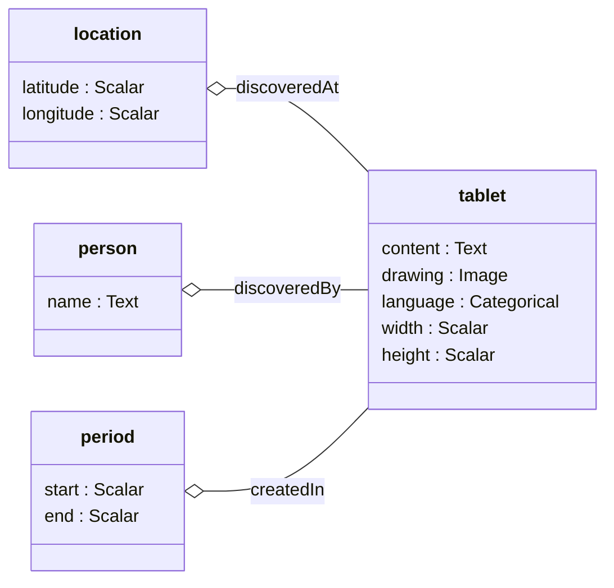

# Unsupervised Cuneiform

In this project, the CDLI and ORACC are training a relational, multi-modal neural net using reconstruction loss. In other words, a model that learns granular and composable notions of similarity without human supervision. It also explores the design space of type- and template-metaprogramming for precise generation of compatible data pipelines, models, and user interfaces.



## Steps for compiling

Assuming you have [GHCUp](https://www.haskell.org/ghcup/) installed:

```
curl --proto '=https' --tlsv1.2 -sSf https://get-ghcup.haskell.org | sh
```

Install a suitable version of GHC and Cabal:

```
ghcup install ghc --set 9.10.3
ghcup install cabal --set 3.16.0.0
```

Compile:

```
cabal build
```

Invoke tests, scripts, etc:

```
cabal test

cabal run -- marshal_corpus --fields data/cdli_fields_sample.csv.gz --atf data/cdli_trans_sample.atf.gz --oraccPath data/ --imagePath data/ --output output.jsonl.gz
```

Errors during compilation or invocation may mean you need to install required system-level libraries.  For instance, a message about missing `bz2` might be resolved on a Debian-based system with:

```
sudo apt install libbz2-dev
```
