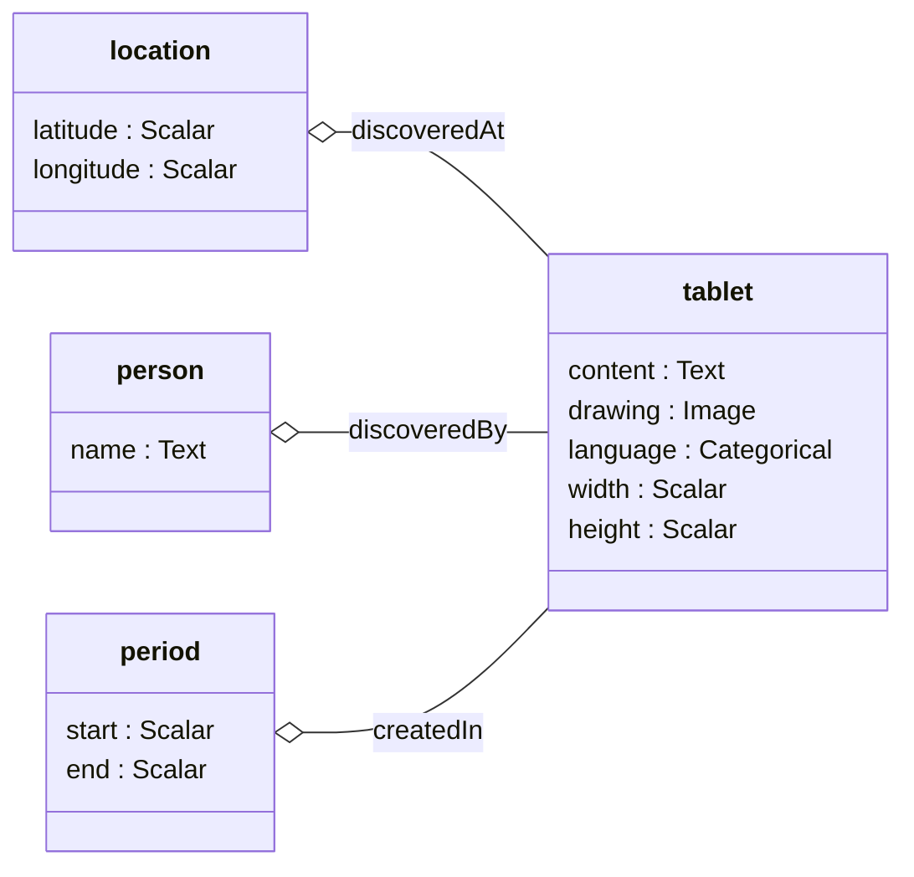

# Unsupervised Cuneiform

In this project, structured data from the Cuneiform Digital Library and ORACC projects are used to generate and train a relational, multi-modal neural model. Based on reconstruction loss, the model learns granular and composable notions of similarity without human supervision. It also explores the design space of type- and template-metaprogramming for precise generation of compatible data pipelines, models, and user interfaces. Consider the following (very simplified) diagram of the structured object-relational model the CDLI encodes:



The corresponding type-level description of this domain is:

```haskell
type Cuneiform = '[ '( "tablet"
                     , '[ '( "drawing", Image )
                        , '( "width", Scalar )
                        , '( "height", Scalar )
                        , '( "language", Categorical )
                        , '( "content", Text )
                        , '( "discoveredBy", Related "person" )
                        , '( "discoveredAt", Related "location" )
                        , '( "createdIn", Related "period" )
                        ]
                     )
                  , '( "location"
                     , '[ '( "latitude", Scalar )
                        , '( "longitude", Scalar )
                        ]
                     )
                  , '( "person"
                     , '[ '( "name", Text )
                        ]
                     )
                  , '( "period"
                     , '[ '( "start", Scalar )
                        , '( "end", Scalar )
                        ]
                     )
                  ]
```

It is a list of *entity-types*, each of which has a list of *properties*, each of which simply states what type of information that property consists of. Right now, the simple property-types are *Scalar*, *Categorical*, *Text*, and *Image*. The *Related* type describes how entities can be related, e.g. a "tablet" can be "discoveredAt" a "location". Property types may be considerably expanded or specialized in the future, but for now these cover a broad swathe of potential domains.

This simple, but precise and formal, specification is then used to generate various computational machinery using a combination of Haskell's type-level abstractions (from extensions like `GADTs`, `TypeFamilies`, `PolyKinds`, etc) such that the procedures described in the technical section below are automatically derived and  hidden from the domain expert scholar, and formally verified by the compiler. In short, this guarantees compatibility and well-formedness across the materials, model definitions, training process, and interpretation interface.

## Steps for compiling

Assuming you have [GHCUp](https://www.haskell.org/ghcup/) installed:

```
curl --proto '=https' --tlsv1.2 -sSf https://get-ghcup.haskell.org | sh
```

Install a suitable version of GHC and Cabal:

```
ghcup install ghc --set 9.10.3
ghcup install cabal --set 3.16.0.0
```

Compile:

```
cabal build
```

Invoke tests, scripts, etc:

```
cabal test

cabal run -- marshal_corpus --fields data/cdli_fields_sample.csv.gz --atf data/cdli_trans_sample.atf.gz --oraccPath data/ --imagePath data/ --output output.jsonl.gz
```

Errors during compilation or invocation may mean you need to install required system-level libraries.  For instance, a message about missing `bz2` might be resolved on a Debian-based system with:

```
sudo apt install libbz2-dev
```
